# Contextual Dependency Injection (Request Scope)

*Read this in [English](./dependency-injection.md) or [Português (BR)](./dependency-injection.pt-BR.md).*

**Contextual Dependency Injection (Request Scope)** in Horse enables the deterministic lifecycle management of service instances and classes directly coupled to the active HTTP request lifecycle.

By registering request-scoped services, developers ensure complete thread-safe state isolation between concurrent requests and benefit from the automatic disposal of instantiated resources at the end of the HTTP routing pipeline. This eliminates memory leaks and the need for manual `try/finally` blocks inside route closures.

---

## 🗺️ Dependency Injection Lifecycle

The lifecycle of the `Services` request property is described in the sequence diagram below:

```mermaid
sequenceDiagram
    autonumber
    participant Client as HTTP Client
    participant Horse as THorseRequest (Services)
    participant Core as THorseRequestContext (Dictionary)
    participant Disposer as Automatic Disposal

    Client->>Horse: HTTP Request starts
    Note over Horse: Services (Lazy-initialized on first access)

    rect rgb(20, 20, 30)
        Note over Horse: Services Registration
        Horse->>Core: Req.Services.Add(TMyService, Instance)
        Note right of Core: Registered as owned instance
    end

    rect rgb(20, 30, 20)
        Note over Horse: Services Resolution
        Horse->>Core: Req.Services.Resolve(TMyService)
        Core-->>Horse: Returns typed instance
    end

    Client->>Horse: HTTP Routing pipeline finishes
    Horse->>Disposer: THorseRequest.Clear or Destroy triggered
    Disposer->>Core: Triggers FreeAndNil(FServices)
    Note over Core: Destroys all owned instances (doOwnsValues)
    Note over Core: Disposal Completed (Zero Memory Leaks!)
```



---

## 🛠️ Injection and Registration Modes

The `Services` property offers two main ways to register dependencies, each with specific behaviors:

### 1. Direct Instance Injection (`Add`)
Registers a previously created object instance in the context of the current request. By default, the context class takes ownership of the object and destroys it automatically at the end of the request.

```delphi
Req.Services.Add(TMyService, TMyService.Create);
```

### 2. Lazy Injection via Factory (`AddFactory`)
Registers a factory delegate that defines how to create the service on-demand (*Lazy Loading*). The service is only physically instantiated at the exact moment it is resolved (when calling `Resolve`). Once instantiated, it is cached in the context of the current request and automatically destroyed when the request ends.

```delphi
Req.Services.AddFactory(TMyService,
  function: TObject
  begin
    Result := TMyService.Create;
  end);
```

---

## 💻 Complete Practical Example

```delphi
program ConsoleDependencyInjection;

{$APPTYPE CONSOLE}

uses
  Horse, Horse.Commons, System.SysUtils;

type
  TMyService = class
  private
    FId: string;
  public
    constructor Create(const AId: string);
    destructor Destroy; override;
    function GetMessage: string;
  end;

{ TMyService }

constructor TMyService.Create(const AId: string);
begin
  inherited Create;
  FId := AId;
  Writeln(Format('[TMyService] Instantiated with ID: %s', [FId]));
end;

destructor TMyService.Destroy;
begin
  Writeln(Format('[TMyService] Destroyed with ID: %s (Automatically cleaned up)', [FId]));
  inherited Destroy;
end;

function TMyService.GetMessage: string;
begin
  Result := 'Hello from a Contextual Service! ID: ' + FId;
end;

begin
  // Route 1: Using Direct Instance Injection
  THorse.Get('/resolve',
    procedure(Req: THorseRequest; Res: THorseResponse; Next: TProc)
    var
      LService: TMyService;
    begin
      LService := TMyService.Create('Direct');
      Req.Services.Add(TMyService, LService);
      Next();
    end,
    procedure(Req: THorseRequest; Res: THorseResponse; Next: TProc)
    var
      LService: TMyService;
    begin
      LService := TMyService(Req.Services.Resolve(TMyService));
      Res.Send(LService.GetMessage);
    end);

  // Route 2: Using Lazy Factory (Lazy Loading)
  THorse.Get('/lazy',
    procedure(Req: THorseRequest; Res: THorseResponse; Next: TProc)
    begin
      Req.Services.AddFactory(TMyService,
        function: TObject
        begin
          Result := TMyService.Create('Lazy');
        end);
      Next();
    end,
    procedure(Req: THorseRequest; Res: THorseResponse; Next: TProc)
    var
      LService: TMyService;
    begin
      // The factory will be executed and the service instantiated only on the line below!
      LService := TMyService(Req.Services.Resolve(TMyService));
      Res.Send(LService.GetMessage);
    end);

  THorse.Listen(9000);
end.
```

---

## 📈 Architectural Benefits

1. **Deterministic and Automatic Lifecycle:** Ensures resources are safely disposed of at the end of the HTTP routing pipeline, eliminating memory leaks.
2. **Concurrent State Isolation:** Fully thread-safe, allowing each concurrent request to process its service instances in complete isolation, avoiding race conditions.
3. **Native Lazy Initialization:** Reduced RAM footprint and faster request processing overheads using `AddFactory`, instantiating services only when required by the executed route.
