# Injeção de Dependência Contextual (Request Scope)

*Read this in [English](./dependency-injection.md) or [Português (BR)](./dependency-injection.pt-BR.md).*

O **Gerenciamento e Injeção de Dependência Contextual (Request Scope)** no Horse permite o gerenciamento determinístico do ciclo de vida de instâncias de serviços e classes acopladas diretamente ao ciclo de vida da requisição HTTP ativa.

Ao registrar serviços em escopo de requisição, o desenvolvedor garante o isolamento completo de estado entre requisições concorrentes (thread-safe) e conta com o descarte automático dos recursos instanciados ao final do pipeline de roteamento HTTP, eliminando por completo vazamentos de memória (memory leaks) e a necessidade de blocos `try/finally` manuais nas closures de rotas.

---

## 🗺️ Ciclo de Vida da Injeção de Dependências

O ciclo de vida da propriedade `Services` na requisição segue a sequência descrita no diagrama abaixo:

```mermaid
sequenceDiagram
    autonumber
    participant Cliente as Cliente HTTP
    participant Horse as THorseRequest (Services)
    participant Core as THorseRequestContext (Dicionário)
    participant Destrutor as Destruição Automática

    Cliente->>Horse: Requisição HTTP iniciada
    Note over Horse: Services (Lazy-initialized no primeiro acesso)

    rect rgb(20, 20, 30)
        Note over Horse: Registro de Serviços
        Horse->>Core: Req.Services.Add(TMyService, Instance)
        Note right of Core: Registrado como instância pertencente
    end

    rect rgb(20, 30, 20)
        Note over Horse: Resolução de Serviços
        Horse->>Core: Req.Services.Resolve(TMyService)
        Core-->>Horse: Retorna instância tipada
    end

    Cliente->>Horse: Pipeline de roteamento é finalizado
    Horse->>Destrutor: THorseRequest.Clear ou Destroy é acionado
    Destrutor->>Core: Dispara FreeAndNil(FServices)
    Note over Core: Destrói todas as instâncias pertencentes (doOwnsValues)
    Note over Core: Descarte Concluído (Zero Memory Leaks!)
```



---

## 🛠️ Modos de Injeção e Registro

A propriedade `Services` fornece duas formas principais de registro de dependências com comportamentos específicos:

### 1. Injeção de Instância Direta (`Add`)
Registra uma instância de objeto previamente criada no contexto da requisição corrente. Por padrão, a classe gerenciadora assume a propriedade (ownership) do objeto, descartando-o automaticamente ao final do request.

```delphi
Req.Services.Add(TMyService, TMyService.Create);
```

### 2. Injeção Preguiçosa via Fábrica (`AddFactory`)
Registra um delegate de fábrica (factory method) que define como criar o serviço sob demanda (*Lazy Loading*). O serviço só é instanciado fisicamente no primeiro momento em que for resolvido (chamada de `Resolve`). Uma vez instanciado, ele é cacheado no contexto da requisição corrente e destruído automaticamente ao término da requisição.

```delphi
Req.Services.AddFactory(TMyService,
  function: TObject
  begin
    Result := TMyService.Create;
  end);
```

---

## 💻 Exemplo Prático Completo

```delphi
program ConsoleDependencyInjection;

{$APPTYPE CONSOLE}

uses
  Horse, Horse.Commons, System.SysUtils;

type
  TMyService = class
  private
    FId: string;
  public
    constructor Create(const AId: string);
    destructor Destroy; override;
    function GetMessage: string;
  end;

{ TMyService }

constructor TMyService.Create(const AId: string);
begin
  inherited Create;
  FId := AId;
  Writeln(Format('[TMyService] Instanciado com ID: %s', [FId]));
end;

destructor TMyService.Destroy;
begin
  Writeln(Format('[TMyService] Destruído com ID: %s (Limpo de forma automática)', [FId]));
  inherited Destroy;
end;

function TMyService.GetMessage: string;
begin
  Result := 'Olá de um Serviço Contextual! ID: ' + FId;
end;

begin
  // Rota 1: Usando Injeção de Instância Direta
  THorse.Get('/resolve',
    procedure(Req: THorseRequest; Res: THorseResponse; Next: TProc)
    var
      LService: TMyService;
    begin
      LService := TMyService.Create('Direto');
      Req.Services.Add(TMyService, LService);
      Next();
    end,
    procedure(Req: THorseRequest; Res: THorseResponse; Next: TProc)
    var
      LService: TMyService;
    begin
      LService := TMyService(Req.Services.Resolve(TMyService));
      Res.Send(LService.GetMessage);
    end);

  // Rota 2: Usando Lazy Factory (Carregamento Preguiçoso)
  THorse.Get('/lazy',
    procedure(Req: THorseRequest; Res: THorseResponse; Next: TProc)
    begin
      Req.Services.AddFactory(TMyService,
        function: TObject
        begin
          Result := TMyService.Create('Lazy');
        end);
      Next();
    end,
    procedure(Req: THorseRequest; Res: THorseResponse; Next: TProc)
    var
      LService: TMyService;
    begin
      // A fábrica só será executada e o serviço só será instanciado na linha abaixo!
      LService := TMyService(Req.Services.Resolve(TMyService));
      Res.Send(LService.GetMessage);
    end);

  THorse.Listen(9000);
end.
```

---

## 📈 Benefícios Arquiteturais

1. **Ciclo de Vida Determinístico e Automático:** Garante o descarte seguro de recursos ao término do pipeline HTTP da requisição ativa, eliminando memory leaks.
2. **Isolamento de Estado Concorrente:** Totalmente thread-safe, permitindo que cada thread/request trate suas instâncias de serviços de forma isolada, evitando race conditions.
3. **Lazy Initialization nativa:** Redução no consumo de RAM e no tempo de inicialização de recursos pesados por meio do `AddFactory`, carregando somente o que é realmente demandado pela rota executada.
