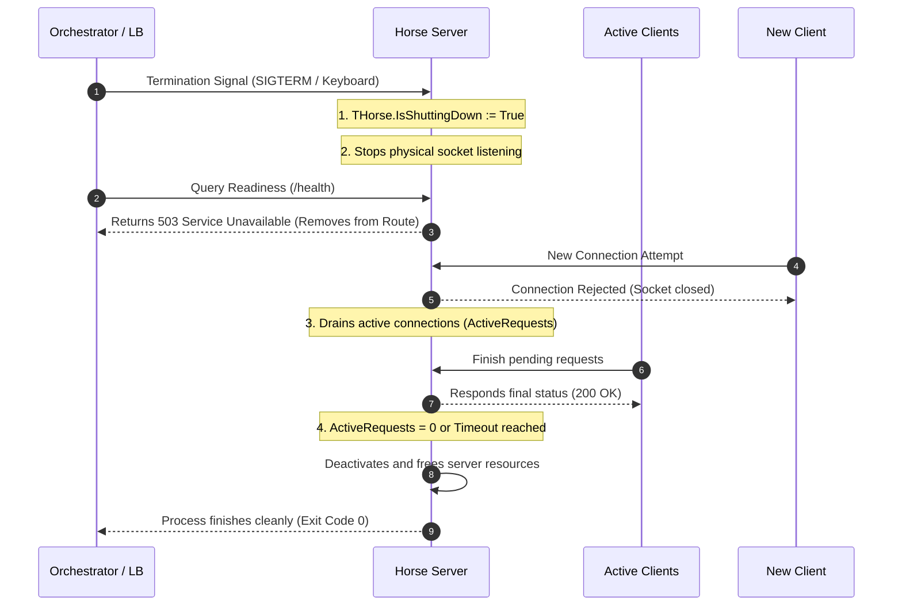

# Graceful Shutdown

*Read this in [English](./graceful-shutdown.md) or [Português (BR)](./graceful-shutdown.pt-BR.md).*

The **Graceful Shutdown** in Horse allows the server to be shut down in a coordinated manner in production environments (cloud-native environments like Kubernetes, Docker, or under load balancers).

Instead of dropping the physical socket immediately (which would abruptly abort ongoing requests generating HTTP 502/504 errors for users), graceful shutdown suspends the listening of new connections and waits for all actively processing requests to finish responding safely under a safety timeout.

---

## 🗺️ Coordinated Shutdown Flow

When a graceful shutdown is requested via the `StopListenGraceful` method, the shutdown lifecycle follows the sequence below:



---

## 🔌 Telemetry and Observability Properties

To facilitate monitoring and cloud-native integration, we exposed two public static telemetry properties in the main class of the framework:

* **`THorse.ActiveRequests`:** Returns the instant total of physical requests actively processing in the routing pipeline. Essential for exporting load metrics to collectors like Prometheus (APM).
* **`THorse.IsShuttingDown`:** Returns `True` from the moment the graceful shutdown was initiated. Useful for health check endpoints (Readiness).

---

## 🛠️ How to Use in Practice

To perform a graceful shutdown in Horse, call the `StopListenGraceful(const ATimeoutMS: Integer = 5000)` method passing the maximum timeout in milliseconds to force the shutdown.

### Supported Providers
The graceful shutdown protocol and escoament loop are natively implemented in the following providers:
* **Console Provider** (`Horse.Provider.Console`)
* **VCL Provider** (`Horse.Provider.VCL`)
* **Daemon Provider** (`Horse.Provider.Daemon`)
* **Lazarus/LCL Provider** (`Horse.Provider.FPC.LCL`)
* **Lazarus Daemon Provider** (`Horse.Provider.FPC.Daemon`)

### Complete Example:

```delphi
program ConsoleGracefulShutdown;

{$APPTYPE CONSOLE}

uses
  Horse, System.SysUtils, System.Classes, Horse.Commons;

begin
  // Endpoint simulating a slow process (e.g. exporting a report)
  THorse.Get('/slow-report',
    procedure(Req: THorseRequest; Res: THorseResponse; Next: TProc)
    begin
      TThread.Sleep(2000);
      Res.Send('Report exported successfully!');
    end);

  // Health Check Endpoint (Readiness / Liveness)
  THorse.Get('/health',
    procedure(Req: THorseRequest; Res: THorseResponse; Next: TProc)
    begin
      if THorse.IsShuttingDown then
      begin
        // Returns 503 so the Load Balancer removes the instance from the route
        Res.Send('Shutting down').Status(THTTPStatus.ServiceUnavailable);
      end
      else
      begin
        Res.Send(Format('Healthy. Active requests: %d', [THorse.ActiveRequests]));
      end;
    end);

  // Callback when server starts
  THorse.OnListen :=
    procedure
    begin
      Writeln('Server running on port ', THorse.Port);
      Writeln('Press ENTER to trigger Graceful Shutdown...');
    end;

  // Starts the Horse server
  THorse.Listen(9000);

  // Waits for console command
  Readln;

  // Triggers graceful shutdown waiting up to 5 seconds to drain requests
  Writeln('Shutting down gracefully (waiting for completions)...');
  THorse.StopListenGraceful(5000);
  Writeln('Server stopped successfully!');
end.
```

---

## 📈 Real Gains for the User

1. **Zero Downtime in Deployments:** Kubernetes or Docker Swarm can perform batch deployments (Rolling Updates) safely, without any client receiving broken connection errors during container replacement.
2. **Simplified Kubernetes Integration:** Immediate ease in mapping *Readiness Probe* sensors pointing to the `/health` endpoint that responds dynamically based on the `THorse.IsShuttingDown` property.
3. **Native Telemetry Metrics:** Facilitated monitoring of the concurrent load with `THorse.ActiveRequests`.
