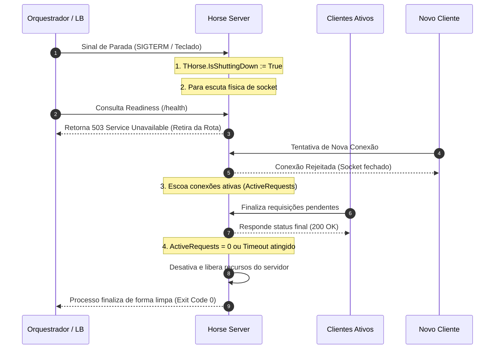

# Desligamento Suave (Graceful Shutdown)

*Read this in [English](./graceful-shutdown.md) or [Português (BR)](./graceful-shutdown.pt-BR.md).*

O **Desligamento Suave (Graceful Shutdown)** no Horse permite que o servidor seja encerrado de forma coordenada em ambientes produtivos (nativos em nuvem como Kubernetes, Docker, ou sob balanceadores de carga). 

Em vez de derrubar o socket físico imediatamente (o que abortaria abruptamente as requisições em andamento gerando erros HTTP 502/504 para os usuários), o desligamento suave suspende a escuta de novas conexões e aguarda que todos os requests ativamente em processamento terminem de responder de forma segura sob um tempo limite (timeout) de segurança.

---

## 🗺️ Fluxo de Desligamento Coordenado

Quando o encerramento suave é solicitado através do método `StopListenGraceful`, o ciclo de vida do desligamento segue a sequência abaixo:



---

## 🔌 Propriedades de Telemetria e Observabilidade

Para facilitar o monitoramento e a integração nativa em nuvem, expusemos no facade principal do framework duas propriedades públicas estáticas de telemetria:

* **`THorse.ActiveRequests`:** Retorna o total instantâneo de requisições físicas em processamento concorrente no pipeline de roteamento. Essencial para exportar métricas de carga para coletores como Prometheus (APM).
* **`THorse.IsShuttingDown`:** Retorna `True` a partir do momento em que o desligamento suave foi iniciado. Útil para endpoints de health check (Readiness).

---

## 🛠️ Como Utilizar no Dia a Dia

Para realizar o desligamento suave no Horse, chame o método `StopListenGraceful(const ATimeoutMS: Integer = 5000)` passando o tempo limite máximo em milissegundos para forçar o encerramento.

### Provedores Suportados
O protocolo de desligamento suave e o ciclo de escoamento de requisições ativas estão implementados de forma nativa nos seguintes provedores:
* **Console Provider** (`Horse.Provider.Console`)
* **VCL Provider** (`Horse.Provider.VCL`)
* **Daemon Provider** (`Horse.Provider.Daemon`)
* **Lazarus/LCL Provider** (`Horse.Provider.FPC.LCL`)
* **Lazarus Daemon Provider** (`Horse.Provider.FPC.Daemon`)

### Exemplo Completo:

```delphi
program ConsoleGracefulShutdown;

{$APPTYPE CONSOLE}

uses
  Horse, System.SysUtils, System.Classes, Horse.Commons;

begin
  // Endpoint simulando um processamento lento (ex: exportação de relatório)
  THorse.Get('/slow-report',
    procedure(Req: THorseRequest; Res: THorseResponse; Next: TProc)
    begin
      TThread.Sleep(2000);
      Res.Send('Relatório exportado com sucesso!');
    end);

  // Endpoint de Health Check (Readiness / Liveness)
  THorse.Get('/health',
    procedure(Req: THorseRequest; Res: THorseResponse; Next: TProc)
    begin
      if THorse.IsShuttingDown then
      begin
        // Retorna 503 para que o Load Balancer retire a instância da rota
        Res.Send('Shutting down').Status(THTTPStatus.ServiceUnavailable);
      end
      else
      begin
        Res.Send(Format('Healthy. Active requests: %d', [THorse.ActiveRequests]));
      end;
    end);

  // Callback ao levantar o servidor
  THorse.OnListen :=
    procedure
    begin
      Writeln('Servidor executando na porta ', THorse.Port);
      Writeln('Pressione ENTER para acionar o Graceful Shutdown...');
    end;

  // Inicia o servidor Horse
  THorse.Listen(9000);

  // Aguarda comando do console
  Readln;

  // Aciona o desligamento suave aguardando até 5 segundos para escoar os requests
  Writeln('Desligando de forma suave (aguardando finalizações)...');
  THorse.StopListenGraceful(5000);
  Writeln('Servidor parado com sucesso!');
end.
```

---

## 📈 Ganhos Reais para o Usuário

1. **Zero Downtime em Deployments:** O Kubernetes ou o Docker Swarm podem realizar deploys em lote (Rolling Updates) com segurança, sem que nenhum cliente receba erros de conexão quebrada durante a substituição dos containers.
2. **Integração Simplificada com Kubernetes:** Facilidade imediata para mapear sondas de *Readiness Probe* apontando para o endpoint `/health` que responde dinamicamente com base na propriedade `THorse.IsShuttingDown`.
3. **Métricas de Telemetria Nativas:** Monitoramento facilitado da carga concorrente com `THorse.ActiveRequests`.
