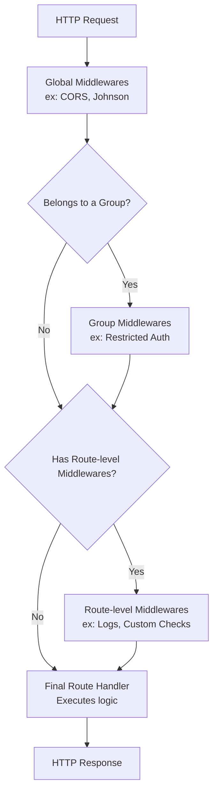

# Horse Documentation

*Read this in [English](./index.md) or [Português (BR)](./index.pt-BR.md).*

Welcome. This is the documentation hub for [Horse](https://github.com/HashLoad/horse) — an Express-inspired web framework for Delphi and Lazarus.

If you're new, start with [Getting Started](./getting-started.md). If you have a working server and want to make a specific change, jump straight to the relevant topic below.

## Middleware Execution Flow

When an HTTP request reaches the Horse server, it flows through the middleware layers in the following precedence order:



---

## Reading order for newcomers

1. **[Getting Started](./getting-started.md)** — install, write a hello-world server, run it.
2. **[Routing](./routing.md)** — declare endpoints, path parameters, route groups, query strings.
3. **[Request & Response](./request-response.md)** — read the request, write the response, headers, cookies, sessions, file uploads/downloads.
4. **[Middleware](./middleware.md)** — chain handlers, registration order, write your own. For publishing reusable middleware, see **[Writing a Middleware](./writing-middleware.md)**.
5. **[Providers & Application types](./providers.md)** — pick the transport Provider (Indy default; CrossSocket, mORMot2, and ICS optional; HttpSys, epoll and IOCP built-in) and the Application type (Console default, VCL, Daemon, LCL, HTTPApplication) — or a host-managed application type (Apache, ISAPI, CGI, FastCGI).

## Reference

| Document | What you'll find |
|---|---|
| [Getting Started](./getting-started.md) | Install via Boss; minimal Delphi and Lazarus examples; project structure conventions. |
| [Routing](./routing.md) | `THorse.Get` / `Post` / `Put` / `Delete` / `Patch` / `Head` / `Use`; path params; route groups; wildcards; HTTP method enum. |
| [Request & Response](./request-response.md) | `THorseRequest` (body, params, query, headers, cookies, sessions, multipart). `THorseResponse` (`Send`, `Status`, `ContentType`, `AddHeader`, `RedirectTo`, `SendFile`, `Download`, `RawWebResponse`). |
| [Middleware](./middleware.md) | The `Next` proc model; built-in vs custom; registration order; per-route vs global. |
| [Lifecycle Hooks](./lifecycle-hooks.md) | Request lifecycle hooks (`onRequest`, `preParsing`, `preValidation`, `onSend`, `onResponse`) to extend and intercept request/response pipelines. |
| [Dependency Injection](./dependency-injection.md) | Lifecycle management and IoC on request scope (direct and lazy injectors). |
| [Graceful Shutdown](./graceful-shutdown.md) | Coordinated connection shutdown in production environments (cloud/Kubernetes); telemetry properties `ActiveRequests` and flag `IsShuttingDown`. |
| [Multi-Instance](./multi-instance.md) | Run and isolate multiple independent HTTP servers, routing tables, and middlewares on different ports concurrently within the same process. |
| [Writing a Middleware](./writing-middleware.md) | Authoring a production-quality middleware: skeleton, configuration patterns, thread safety, Provider-neutral coding, cross-compiler pitfalls, testing matrix, Boss packaging, publishing. |
| [Providers & Application types](./providers.md) | The two-axis model: **Provider** (transport — Indy default; CrossSocket, mORMot2, ICS optional; HttpSys, epoll and IOCP built-in) × **Application type** (Console / VCL / Daemon / LCL / HTTPApplication, plus host-managed Apache / ISAPI / CGI / FCGI). Compatibility matrix and selection guidance. |
| [Middleware Ecosystem](./middleware-ecosystem.md) | Official `HashLoad/*` packages and the community-maintained list. |
| [Observability & Telemetry](./telemetry.md) | Setting up distributed tracing (OpenTelemetry) and metrics collection (Prometheus). |
| [Compiler Support](./compiler-support.md) | Tested Delphi releases, FPC versions, target platforms, compiler-version guards. |
| [Deployment Cheatsheet](./deployment.md) | One-page reference for shipping a CrossSocket or mORMot2 binary as any of the seven Application shapes (Console / VCL / Daemon / Windows Service / FPC daemon / LCL / FPC HTTPApplication). |
| [Integrity Testing](./integrity-testing.md) | Automated integration, resilience (Access Violation) and SO limit testing. |

## How the docs are organised

```
README.md                      ← landing page; one-paragraph intro and links here
doc/
├── index.md                   ← this file
├── getting-started.md         ← first 30 minutes with Horse
├── routing.md                 ← URL → handler binding
├── request-response.md        ← THorseRequest and THorseResponse API
├── middleware.md              ← chaining handlers
├── lifecycle-hooks.md         ← request lifecycle hooks (onRequest, etc.)
├── dependency-injection.md    ← contextual dependency injection on request scope
├── graceful-shutdown.md       ← graceful connection shutdown in production
├── multi-instance.md          ← running multiple concurrent servers
├── providers.md               ← choosing a transport
├── iocp.md                    ← Windows async I/O completion ports
├── epoll.md                   ← Linux async event loop
├── telemetry.md               ← OpenTelemetry & Prometheus integration
├── middleware-ecosystem.md    ← package catalogue
├── integrity-testing.md       ← integrity and resilience testing
└── compiler-support.md        ← versions / platforms
```

Each document is self-contained and cross-links to the others where relevant. There is no required reading order beyond the newcomer flow above.

## Contributing to the docs

Edits welcome — open a PR against `master` modifying the relevant file under `doc/`. Keep each page focused on one topic; if a section grows beyond a few hundred lines, split it into a sibling document and link from `index.md`.

## Got stuck?

- Telegram channel: [@hashload](https://t.me/hashload)
- GitHub Issues: [`HashLoad/horse/issues`](https://github.com/HashLoad/horse/issues)
- Source code is short and readable — when in doubt, `Horse.pas`, `Horse.Request.pas`, and `Horse.Response.pas` together total under 2 000 lines.
