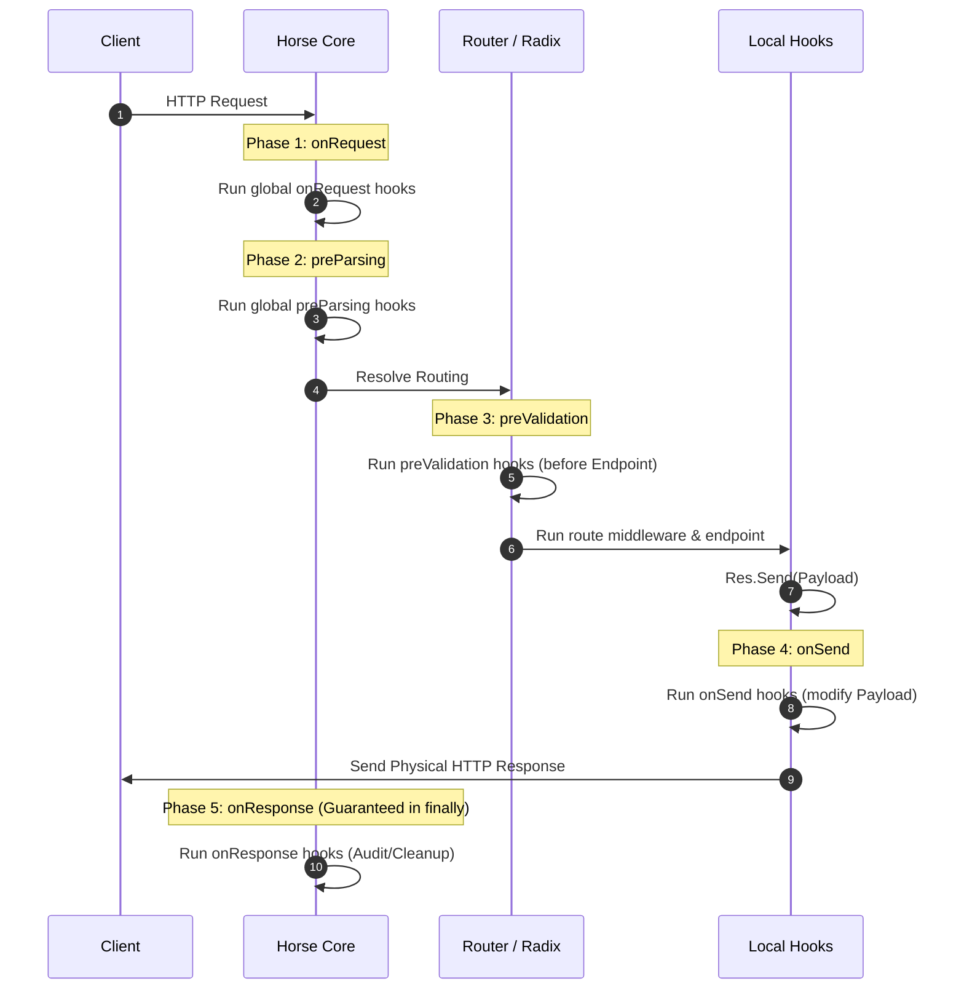

# Lifecycle Hooks

*Read this in [English](./lifecycle-hooks.md) or [Português (BR)](./lifecycle-hooks.pt-BR.md).*

The **Lifecycle Hooks** in Horse provide standardized, guaranteed extension points throughout the lifecycle of an HTTP request.

Unlike traditional middleware, hooks run at precise architectural phases, allowing you to intercept and manipulate request/response data without relying on the ordering of middlewares in the `Next` chain.

---

## 🗺️ Request Lifecycle Flow

When an HTTP request hits the Horse server, the request pipeline strictly follows this sequence:



---

## 🔌 1. onRequest (Entry Phase)

The `onRequest` hook is executed at the very beginning of the request handling, **before routing** and before checking any route path segments.

* **Signature:** `THorseCallback`
* **Use Cases:**
  * Simple firewalls (WAF) or IP blacklisting.
  * Fast global validation that shouldn't pay the performance price of a complex router lookup.
  * Modifying or injecting early request headers.

### Example:
```delphi
THorse.AddOnRequest(
  procedure(Req: THorseRequest; Res: THorseResponse; Next: TProc)
  begin
    // Block requests without a corporate ID header
    if Req.Headers['X-Corporate-ID'] = '' then
      Res.Send('Unauthorized').Status(THTTPStatus.Unauthorized)
    else
      Next; // Continue to the next phase
  end);
```

---

## 📦 2. preParsing (Raw Payload Phase)

The `preParsing` hook runs after `onRequest` but before any body parsing middleware (like the `Jhonson` JSON parser) reads or interprets the request `Body`.

* **Signature:** `THorseCallback`
* **Use Cases:**
  * Decrypting incoming payloads. If the request body is encrypted, you can decrypt and re-inject it so that downstream JSON parser middlewares see the clean, unencrypted JSON.
  * Uncompressing custom input compression formats.

### Example:
```delphi
THorse.AddPreParsing(
  procedure(Req: THorseRequest; Res: THorseResponse; Next: TProc)
  begin
    // Decrypt the raw body received from the client before parsing it to JSON
    var RawEncrypted := Req.Body;
    var DecryptedJSON := MyCryptoHelper.Decrypt(RawEncrypted);
    Req.Body(DecryptedJSON); // Replace the body in the request
    Next;
  end);
```

---

## 🛡️ 3. preValidation (Rules Phase)

The `preValidation` hook is executed once the active route is resolved, but **before** executing the first route-level middleware or the endpoint handler.

* **Signature:** `THorseCallback`
* **Use Cases:**
  * Declarative validation (such as DTO schema validation).
  * Validating permissions and authentication tokens specific to the active route.

### Example:
```delphi
THorse.AddPreValidation(
  procedure(Req: THorseRequest; Res: THorseResponse; Next: TProc)
  begin
    // Example: JWT token validation specific to the resolved route
    if not IsTokenValidForRoute(Req.MatchedRoute, Req.Headers['Authorization']) then
      Res.Send('Forbidden').Status(THTTPStatus.Forbidden)
    else
      Next;
  end);
```

---

## ✉️ 4. onSend (Send Phase)

The `onSend` hook intercepts calls to `Res.Send(string)` and `Res.Send(TBytes)` right before the payload is physically written to the client socket or socket provider. It allows modifying the response body "in transit".

* **Signature:** 
  * `THorseOnSendString = reference to procedure(const Req: THorseRequest; const Res: THorseResponse; var AContent: string);`
  * `THorseOnSendBytes = reference to procedure(const Req: THorseRequest; const Res: THorseResponse; var AContent: TBytes);`
* **Use Cases:**
  * Auto-encrypting outgoing responses.
  * Automatically appending digital signatures, watermarks, or formatting the payload right before sending.

### Example (String):
```delphi
THorse.AddOnSend(
  procedure(const Req: THorseRequest; const Res: THorseResponse; var AContent: string)
  begin
    // Encrypt the outgoing response JSON transparently before sending to the client
    AContent := MyCryptoHelper.Encrypt(AContent);
  end);
```

---

## 🏁 5. onResponse (Exit / Guaranteed Phase)

The `onResponse` hook executes at the very exit of the request lifecycle. It is wrapped inside a `try..finally` block at the transport layer of the Provider, which guarantees that it **always runs**, regardless of any controller exceptions (like Access Violations or Database connection errors).

* **Signature:** `THorseCallback`
* **Use Cases:**
  * Auditing requests (logging the final physical HTTP status code).
  * Colecting performance metrics (Telemetry/OpenTelemetry).
  * Request-scoped resource cleanup (releasing database connections or transaction scopes allocated for the current thread).

### Example:
```delphi
THorse.AddOnResponse(
  procedure(Req: THorseRequest; Res: THorseResponse; Next: TProc)
  begin
    try
      // Always close/release the database connection opened for this specific thread
      ReleaseConnectionForCurrentThread;
    finally
      Next;
    end;
  end);
```

---

## 🧵 Thread Safety and Concurrency

Since Horse handles HTTP requests concurrently using multiple worker threads (in socket providers like Indy, epoll, or IOCP):
* All hooks run under the context of the worker thread processing the active request.
* You can pass state safely between different hooks using the thread-safe request dictionary (`Req.State`).

---

---

## 🌐 Server Lifecycle Hooks (Server Phase)

Server Lifecycle Hooks allow intercepting startup and shutdown operations of the physical HTTP socket server. 

They are registered globally on the `THorse` facade or locally on a `THorseInstance`. These hooks always receive the **physical port** (`APort: Integer`) resolved by the active transport provider.

* **Signatures:**
  * `THorseServerLifecycleProc = reference to procedure(APort: Integer);`
  * `THorseServerLifecycleMethod = procedure(APort: Integer) of object;`

### Available Hooks

| Hook | Phase | Usage / Intent |
|---|---|---|
| `BeforeListen` | Right before the socket listener starts | Validating host configuration, starting DB pools, pre-warming caches. |
| `AfterListen` | Right after the server starts listening | Logging startup success, announcing port to registry/discovery services. |
| `BeforeStop` | Right before the socket listener closes | Initiating shutdown sequences, signaling load-balancers to remove the node. |
| `AfterStop` | Right after the server has fully stopped | Cleaning up global DB pools, releasing memory or IPC locks. |

### Example:
```delphi
THorse.AddBeforeListen(
  procedure(APort: Integer)
  begin
    Writeln('Server is starting up on port ' + APort.ToString);
  end);

THorse.AddAfterListen(
  procedure(APort: Integer)
  begin
    Writeln('Server physical socket is listening. Accepting connections...');
  end);

THorse.AddBeforeStop(
  procedure(APort: Integer)
  begin
    Writeln('Initiating shutdown sequence for port ' + APort.ToString);
  end);

THorse.AddAfterStop(
  procedure(APort: Integer)
  begin
    Writeln('Physical server has stopped. Socket released.');
  end);
```

---

## 🚀 Executable Samples

You can find ready-to-run audit projects to see hooks executing in real-time (compatible with Windows, Linux, and macOS):
* **Delphi (Windows/Linux):** [samples/delphi/console_lifecycle_hooks/ConsoleLifecycleHooks.dpr](file:///d:/Delphi/horse/samples/delphi/console_lifecycle_hooks/ConsoleLifecycleHooks.dpr)
* **Lazarus/FPC (Windows/Linux/macOS):** [samples/lazarus/console_lifecycle_hooks/ConsoleLifecycleHooks.lpr](file:///d:/Delphi/horse/samples/lazarus/console_lifecycle_hooks/ConsoleLifecycleHooks.lpr)
