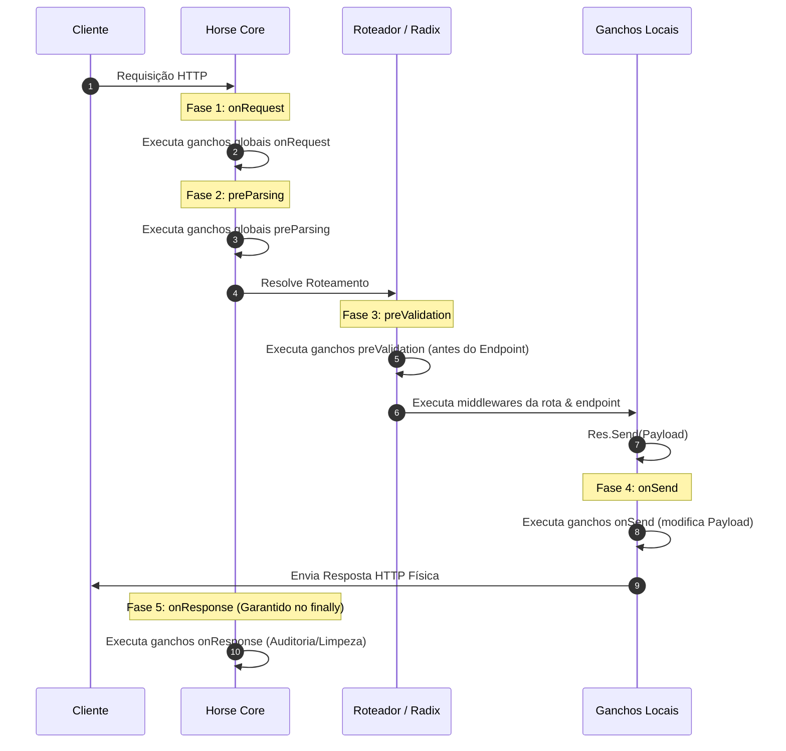

# Ganchos de Ciclo de Vida (Lifecycle Hooks)

*Read this in [English](./lifecycle-hooks.md) or [Português (BR)](./lifecycle-hooks.pt-BR.md).*

Os **Lifecycle Hooks** (Ganchos de Ciclo de Vida da Requisição) no Horse fornecem pontos de extensão padronizados e garantidos ao longo do processamento de uma requisição HTTP. 

Ao contrário dos middlewares tradicionais, os ganchos executam em momentos arquiteturais muito bem definidos, permitindo que você intercepte e manipule dados em fases específicas sem depender da ordem direta de declaração dos middlewares na cadeia `Next`.

---

## 🗺️ O Ciclo de Vida da Requisição

Quando uma requisição atinge o servidor Horse, o pipeline de processamento segue rigorosamente a seguinte sequência temporal de ganchos:



---

## 🔌 1. onRequest (Fase de Entrada)

O gancho `onRequest` é executado logo no início do recebimento da requisição, **antes do roteamento** e antes de qualquer verificação de segmentos de rota.

* **Assinatura:** `THorseCallback`
* **Ganhos no Dia a Dia:**
  * Implementação de firewalls simples (WAF) ou bloqueio de IP.
  * Validações globais rápidas que não devem pagar o preço de performance de um roteamento complexo.
  * Modificação e injeção precoce de headers da requisição.

### Exemplo:
```delphi
THorse.AddOnRequest(
  procedure(Req: THorseRequest; Res: THorseResponse; Next: TProc)
  begin
    // Bloqueia requisições sem o header de identificação corporativa
    if Req.Headers['X-Corporate-ID'] = '' then
      Res.Send('Unauthorized').Status(THTTPStatus.Unauthorized)
    else
      Next; // Continua para a próxima fase
  end);
```

---

## 📦 2. preParsing (Fase de Payload Bruto)

O gancho `preParsing` executa após o `onRequest`, mas antes que qualquer middleware de parsing (como o `Jhonson` para JSON) leia ou interprete o `Body` da requisição.

* **Assinatura:** `THorseCallback`
* **Ganhos no Dia a Dia:**
  * Descriptografia de payloads de entrada. Se o payload vem criptografado por segurança, este gancho permite descriptografar e reinjetar no request para que os middlewares subsequentes já leiam o JSON limpo.
  * Compressão customizada na entrada de tráfego.

### Exemplo:
```delphi
THorse.AddPreParsing(
  procedure(Req: THorseRequest; Res: THorseResponse; Next: TProc)
  begin
    // Descriptografa o body bruto recebido do cliente antes de parsear para JSON
    var RawEncrypted := Req.Body;
    var DecryptedJSON := MinhaCestaCripto.Decrypt(RawEncrypted);
    Req.Body(DecryptedJSON); // Substitui o body no request
    Next;
  end);
```

---

## 🛡️ 3. preValidation (Fase de Regras)

O gancho `preValidation` é executado no momento em que a rota ativa foi resolvida, mas **antes** de começar a rodar o primeiro middleware local ou o handler de endpoint da rota.

* **Assinatura:** `THorseCallback`
* **Ganhos no Dia a Dia:**
  * Validação declarativa de esquemas (como DTO auto-binding).
  * Verificações de permissão e autenticação local para a rota selecionada.

### Exemplo:
```delphi
THorse.AddPreValidation(
  procedure(Req: THorseRequest; Res: THorseResponse; Next: TProc)
  begin
    // Exemplo: Validação geral do token JWT local para a rota
    if not ValidaTokenParaRota(Req.MatchedRoute, Req.Headers['Authorization']) then
      Res.Send('Acesso proibido para a rota').Status(THTTPStatus.Forbidden)
    else
      Next;
  end);
```

---

## ✉️ 4. onSend (Fase de Envio)

O gancho `onSend` intercepta as chamadas para `Res.Send(string)` e `Res.Send(TBytes)` logo antes de o payload ser enviado fisicamente ao cliente ou provider de socket. Ele permite alterar o conteúdo "em trânsito".

* **Assinatura:** 
  * `THorseOnSendString = reference to procedure(const Req: THorseRequest; const Res: THorseResponse; var AContent: string);`
  * `THorseOnSendBytes = reference to procedure(const Req: THorseRequest; const Res: THorseResponse; var AContent: TBytes);`
* **Ganhos no Dia a Dia:**
  * Criptografia automática de respostas de saída.
  * Modificação e injeção automática de assinaturas digitais, marcas d'água no payload, ou formatações globais tardias.

### Exemplo (String):
```delphi
THorse.AddOnSend(
  procedure(const Req: THorseRequest; const Res: THorseResponse; var AContent: string)
  begin
    // Criptografa o JSON de saída de forma transparente antes de enviar ao cliente
    AContent := MinhaCestaCripto.Encrypt(AContent);
  end);
```

---

## 🏁 5. onResponse (Fase de Saída / Garantida)

O gancho `onResponse` executa na saída do pipeline de processamento do request. Ele é envelopado de forma centralizada em um bloco `try..finally` na raiz do Provider, o que garante que **sempre executará**, independentemente de erros internos do servidor, interrupções ou exceções de banco de dados no seu controller.

* **Assinatura:** `THorseCallback`
* **Ganhos no Dia a Dia:**
  * Auditoria final da requisição (gravação de logs definitivos com status HTTP físico final).
  * Coleta de métricas detalhadas (Telemetria/OpenTelemetry).
  * Encerramento e liberação de recursos alocados para a requisição (como transações ativas de banco de dados ou escopo de Request Context).

### Exemplo:
```delphi
THorse.AddOnResponse(
  procedure(Req: THorseRequest; Res: THorseResponse; Next: TProc)
  begin
    try
      // Garante que a transação de banco aberta nesta Thread específica seja finalizada e limpa
      DesconectarBancoDeDadosDaThread;
    finally
      Next;
    end;
  end);
```

---

## 🧵 Thread Safety e Concorrência

Como o Horse processa conexões de forma concorrente em múltiplos sockets ou loops de eventos, todos os hooks executam de forma thread-safe:
* Os ganchos executam sob o contexto da thread que está atendendo a requisição ativa.
* A alteração de estado no `Req.State` (um dicionário thread-safe privado de cada requisição) permite passar informações entre diferentes fases dos hooks de forma isolada e segura.

---

---

## 🌐 Ganchos de Ciclo de Vida do Servidor (Server Phase)

Os Ganchos de Ciclo de Vida do Servidor (*Server Lifecycle Hooks*) permitem interceptar as operações físicas de inicialização (startup) e desligamento (shutdown) do servidor de sockets HTTP.

Eles podem ser registrados globalmente na fachada `THorse` ou localmente em uma `THorseInstance` específica. Esses hooks sempre recebem a **porta física ativa** (`APort: Integer`) resolvida pelo provedor de transporte em execução.

* **Assinaturas:**
  * `THorseServerLifecycleProc = reference to procedure(APort: Integer);`
  * `THorseServerLifecycleMethod = procedure(APort: Integer) of object;`

### Ganchos Disponíveis

| Hook | Fase do Servidor | Uso Sugerido / Intenção |
|---|---|---|
| `BeforeListen` | Instantes antes da abertura do socket físico | Validar configurações de host/porta, iniciar pools globais de conexão de banco de dados, pré-aquecer caches de memória. |
| `AfterListen` | Imediatamente após o início da escuta | Logar sucesso de inicialização na telemetria, anunciar a porta resolvida a serviços de Service Registry / Service Discovery. |
| `BeforeStop` | Instantes antes do fechamento do socket físico | Iniciar sequências de encerramento interno, enviar sinalizadores a Load Balancers para remover o nó da rota de tráfego. |
| `AfterStop` | Imediatamente após a liberação do socket | Destruir pools de banco de dados, liberar trancas de IPC ou recursos de memória compartilhada do processo. |

### Exemplo de Uso:
```delphi
THorse.AddBeforeListen(
  procedure(APort: Integer)
  begin
    Writeln('Servidor iniciando na porta ' + APort.ToString);
  end);

THorse.AddAfterListen(
  procedure(APort: Integer)
  begin
    Writeln('Servidor ativo e aceitando conexoes na porta ' + APort.ToString);
  end);

THorse.AddBeforeStop(
  procedure(APort: Integer)
  begin
    Writeln('Iniciando encerramento suave na porta ' + APort.ToString);
  end);

THorse.AddAfterStop(
  procedure(APort: Integer)
  begin
    Writeln('Servidor parado fisicamente e porta liberada.');
  end);
```

---

## 🚀 Exemplos Práticos Executáveis

Você pode encontrar projetos prontos e auditáveis para executar e ver os hooks rodando no console em tempo real (compatíveis com Windows, Linux e macOS):
* **Delphi (Windows/Linux):** [samples/delphi/console_lifecycle_hooks/ConsoleLifecycleHooks.dpr](file:///d:/Delphi/horse/samples/delphi/console_lifecycle_hooks/ConsoleLifecycleHooks.dpr)
* **Lazarus/FPC (Windows/Linux/macOS):** [samples/lazarus/console_lifecycle_hooks/ConsoleLifecycleHooks.lpr](file:///d:/Delphi/horse/samples/lazarus/console_lifecycle_hooks/ConsoleLifecycleHooks.lpr)
