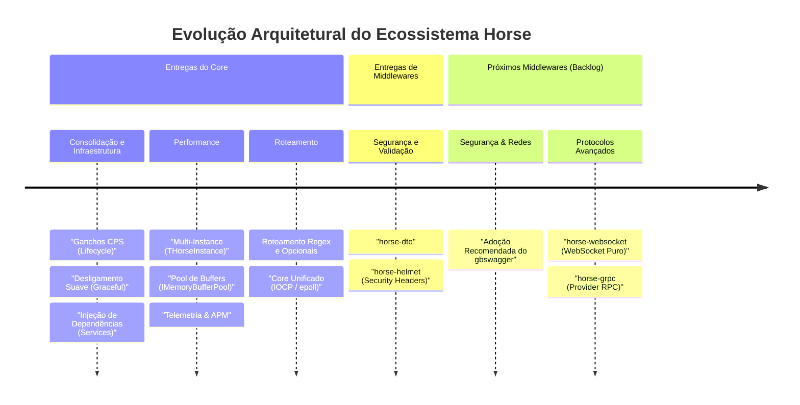

# Roadmap & Evolução Técnica: Horse Framework

Este documento detalha o planejamento de melhorias e novas implementações no ecossistema do framework **Horse**.

> [!IMPORTANT]
> **Filosofia de Design**: Em alinhamento com seu propósito minimalista e focado em alta performance (*Express-inspired*), o **Horse Core** é mantido o mais enxuto possível. Toda nova funcionalidade de alto nível é planejada e implementada prioritariamente na forma de **middlewares oficiais e extensões externas**, evitando o inchaço do núcleo do framework.

---

## 🗺️ Linha do Tempo de Evolução (Roadmap)

O diagrama abaixo apresenta cronologicamente as grandes entregas de infraestrutura já consolidadas no núcleo do framework e os próximos pacotes oficiais de middlewares planejados para o ecossistema:

---

## 📋 Quadro de Evolução do Backlog (Kanban)

Abaixo está o status detalhado das evoluções do framework e de seus middlewares:

| 🟥 A Fazer (Backlog) | 🟨 Em Progresso (Planejamento) | 🟩 Concluído (Entregue) |
|---|---|---|
| **`horse-websocket`** (Middleware) Suporte a conexões bidirecionais e persistentes WebSockets puros. | **Adoção do `gbswagger`** (Comunidade) Integração e recomendação oficial para documentação OpenAPI. | **Roteamento Regex e Opcionais** (Core) Suporte a rotas dinâmicas complexas no Radix e Tree. |
| **`horse-grpc`** (Provedor) Adaptador de transporte focado em RPC binário de alta performance. | | **Ganchos de Telemetria / APM** (Core) Infraestrutura de rastreamento de latência fail-safe. |
| | | **Pool de Buffers de Memória** (Core) Reciclagem de arrays de bytes sem alocações de heap. |
| | | **Middleware `horse-dto`** (Middleware) Desserialização automática e validação por atributos. |
| | | **Middleware `horse-helmet`** (Middleware) Configuração de cabeçalhos de segurança HTTP de forma simples. |
| | | **Multi-Instance e Server Hooks** (Core) Múltiplos servidores no mesmo processo e hooks de inicialização. |
| | | **Cadeia de Middlewares por Rota** (Core) Registro sequencial de callbacks locais nas rotas. |

---

## 🔍 Detalhes das Próximas Evoluções (Backlog)

### 1. Adoção Recomendada do `gbswagger` (Swagger / OpenAPI)
*   **Tipo**: Integração com Biblioteca de Terceiros (Comunidade)
*   **Propósito**: Em vez de fragmentar o ecossistema recriando um novo gerador de documentação, o Horse adota oficialmente e recomenda o uso de **`gabrielbaltazar/gbswagger`** para geração de documentação de rotas automática no padrão OpenAPI. O foco das documentações oficiais será exemplificar a integração suave com este middleware.

### 2. `horse-websocket` (Extensão)
*   **Tipo**: Middleware de Comunicação
*   **Propósito**: Permitir que servidores Horse estabeleçam canais de comunicação duplex persistentes (WebSockets) baseados em padrão puro (RFC 6455). Essencial para aplicações que necessitam de push de eventos em tempo real, com compatibilidade multiplataforma (Delphi e FPC/Lazarus).

### 3. `horse-grpc` (Provedor)
*   **Tipo**: Provedor de Transporte
*   **Propósito**: Fornecer um provider alternativo focado no protocolo gRPC sobre HTTP/2. Permitirá que aplicações Delphi escritas em Horse atuem como microsserviços de altíssima performance para comunicação máquina-máquina.

---

## ✅ Histórico de Entregas Recentes e Consolidadas

Consulte as especificações detalhadas das entregas que moldaram as versões recentes do Horse:

*   **Middleware `horse-helmet`**: Configuração simplificada de cabeçalhos de segurança HTTP (como *Content-Security-Policy*, *X-Content-Type-Options*, *Strict-Transport-Security*) e ocultação de headers reveladores.
*   **Roteamento Regex e Parâmetros Opcionais**: Implementado em ambos os roteadores (`Tree` e `Radix`) de forma nativa e multiplataforma.
*   **Ganchos de Telemetria e APM**: Infraestrutura de baixíssimo overhead para monitoramento de latência e integração com OpenTelemetry.
*   **Pool de Buffers de Memória (`IMemoryBufferPool`)**: Reciclagem de streams assíncronos e arrays, eliminando fragmentação de memória no heap.
*   **Middleware `horse-dto`**: Processamento declarativo com DTOs e validação via atributos.
*   **Refatoração Multi-Instance**: Isolamento lógico de servidores lógicos permitindo rodar em várias portas de forma concorrente no mesmo processo.
*   **Desligamento Suave (Graceful Shutdown)**: Drenagem coordenada de conexões ativas antes do encerramento da porta.
*   **Injeção de Dependências (`Req.Services`)**: Container IoC integrado no ciclo de vida do request.
*   **Ganchos de Ciclo de Vida da Requisição e do Servidor**: Pontos de interceptação padronizados (`onRequest`, `preValidation`, `BeforeListen`, etc.).
