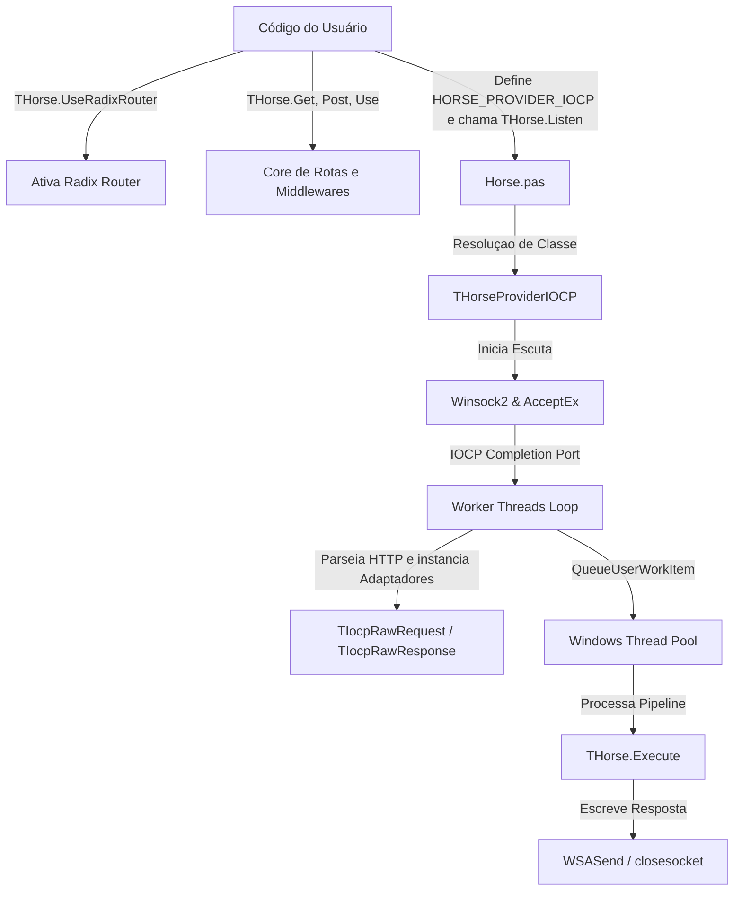

# Plano de Implementação: Provider IOCP Integrado Nativo para o Horse

Este plano descreve a arquitetura, a estratégia de integração do novo provider assíncrono baseado em **IOCP (Input/Output Completion Ports)** nativo para Windows diretamente no core do **Horse** (nos mesmos moldes das integrações do `httpsys` e `epoll`), a atualização completa da documentação e a criação de um exemplo prático demonstrando o uso com o roteador **Radix**.

A integração é projetada para ser **100% não-invasiva**, ou seja, ela estende as opções de transporte do framework através de conditional defines, sem alterar a lógica interna de roteamento, gerenciamento de middlewares ou as assinaturas existentes no core do Horse, garantindo retrocompatibilidade total com projetos e middlewares legados.

## Visão Geral da Arquitetura Integrada



## Proposta de Alterações

As alterações necessárias no repositório principal para incorporar o novo provider nativo, sua documentação e exemplos são detalhadas abaixo.

---

### 1. Código-Fonte do Provider e Core
#### [NEW] [Horse.Provider.IOCP.pas](file:///d:/Delphi/horse/src/Horse.Provider.IOCP.pas)
Este arquivo conterá toda a lógica específica do Winsock2, a manipulação de Completion Ports, o loop de workers e as classes adaptadoras de request/response.

* **Parser HTTP Zero-Allocation**: Um scanner de bytes incremental que lê do buffer de sockets e extrai método, URL, cabeçalhos e parâmetros de corpo diretamente da memória alocada, evitando overhead de criação de strings temporárias ou dicionários na fase de leitura.
* **Pool de Contextos (`TIocpConnectionContext`)**: Objetos e buffers de leitura reutilizáveis para evitar a fragmentação da memória heap do Delphi sob cargas de milhares de requisições por segundo.
* **Pool de Threads de Trabalho**: O processamento de rotas (que pode envolver chamadas bloqueantes a banco de dados por parte do desenvolvedor) é delegado para o Thread Pool do Windows via `QueueUserWorkItem`, mantendo as threads principais do IOCP dedicadas unicamente à E/S de rede ultrarrápida.

#### [MODIFY] [Horse.pas](file:///d:/Delphi/horse/src/Horse.pas)
Para integrar o novo provider ao fluxo de compilação oficial, adicionamos o conditional define `HORSE_PROVIDER_IOCP` de forma isolada:

1. **Guardas de Compilação Mutuamente Exclusivas**:
   Garantir que o `HORSE_PROVIDER_IOCP` seja mutuamente exclusivo com outros transportes assíncronos de sockets (como `HORSE_PROVIDER_CROSSSOCKET` ou `HORSE_PROVIDER_MORMOT`).
2. **Cláusula `uses` condicional**:
   ```delphi
   {$ELSEIF DEFINED(HORSE_PROVIDER_IOCP)}
     {$IFDEF MSWINDOWS}
     Horse.Provider.IOCP,
     {$ELSE}
     {$MESSAGE ERROR 'HORSE_PROVIDER_IOCP is only supported on Windows.'}
     {$ENDIF}
   ```
3. **Resolução de Tipos Condicional**:
   Mapear o alias global `THorseProvider` para a classe concreta do IOCP quando o define estiver ativo no Windows:
   ```delphi
   {$ELSEIF DEFINED(HORSE_PROVIDER_IOCP)}
     THorseProvider =
     {$IFDEF MSWINDOWS}
       Horse.Provider.IOCP.THorseProviderIOCP;
     {$ELSE}
       Horse.Provider.Console.THorseProvider;
     {$ENDIF}
   ```

---

### 2. Exemplo Prático (IOCP + Radix)
#### [NEW] [IocpConsole.dpr](file:///d:/Delphi/horse/samples/delphi/iocp/IocpConsole.dpr)
#### [NEW] [IocpConsole.dproj](file:///d:/Delphi/horse/samples/delphi/iocp/IocpConsole.dproj)
Criar uma aplicação console de exemplo para demonstrar o setup ideal de alto desempenho do Horse no Windows:
* Configurar o conditional define `HORSE_PROVIDER_IOCP` no projeto.
* Chamar `THorse.UseRadixRouter;` na inicialização do console (antes de registrar qualquer rota).
* Definir rotas de exemplo com parâmetros (ex: `/users/:id`) para mostrar o Radix Router realizando a busca otimizada de caminhos.

---

### 3. Atualização da Documentação (Bilíngue EN/PT-BR)
Para manter o alinhamento com a arquitetura do framework, atualizaremos a documentação e os catálogos oficiais:

* **[MODIFY] README.md / README.pt-BR.md**:
  Adicionar o provider `IOCP` à tabela de Providers do transporte do core, sinalizando o define `HORSE_PROVIDER_IOCP`, suporte a Windows e a característica nativa sem necessidade de instalações adicionais.
* **[MODIFY] doc/providers.md / doc/providers.pt-BR.md**:
  Adicionar a descrição detalhada do funcionamento do IOCP, seus requisitos e atualizar a matriz de compatibilidade de Providers × Application Types indicando suporte a Console, VCL e Daemons/Serviços Windows.
* **[NEW] doc/iocp.md / doc/iocp.pt-BR.md**:
  Criar a documentação específica dedicada ao provider IOCP (assim como existe para o `epoll.md` e `httpsys.md`), abordando:
  * Como ativar o provider (`HORSE_PROVIDER_IOCP`).
  * Arquitetura interna baseada em Winsock2 nativo.
  * Otimizações de concorrência e o uso do Windows Thread Pool.

---

## Plano de Verificação e Validação

### Testes Automatizados
1. **Compilação do Exemplo**:
   Verificar se o projeto `samples/delphi/iocp/IocpConsole.dpr` compila sem erros nos compiladores Delphi de 32 e 64 bits.
2. **Execução de Testes de Integração**:
   Executar a suíte DUnitX do Horse no console configurando o define `HORSE_PROVIDER_IOCP` no executável de testes para garantir que todas as rotas e regras passem sem regressões.

### Testes de Carga
1. **Wrk/Bombardier**:
   Validar o desempenho do exemplo `IocpConsole` sob estresse:
   ```bash
   bombardier -c 250 -d 30s http://localhost:9000/users/123
   ```
   Garantir baixa latência e estabilidade da alocação de memória no Gerenciador de Tarefas do Windows durante e após o teste.
